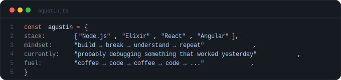
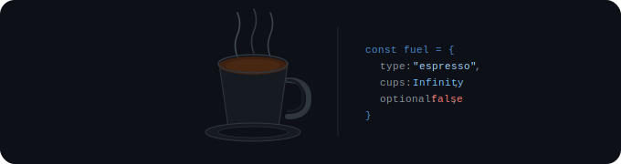

<div align="center">


</div>

<div align="center">
  <h1>agustín.</h1>
  <p><em>curious by nature. obsessive by choice.</em></p>
</div>

<br/>



<br/>

---

## things i've built

> *add yours here*

<br/>

---

## how i feel about my stack

```
Node.js   ████████████████████   daily driver
Elixir    ████████████████░░░░   current obsession
Angular   ████████████████░░░░   where i spend most of my days
React     ███████████████░░░░░   falling down the rabbit hole
coffee    ████████████████████   non-negotiable
```

<br/>



<br/>

---

<div align="center">


</div>

<br/>

---

<div align="center">

<a href="https://linkedin.com/in/avarela2606">
  
</a>
&nbsp;
<a href="mailto:agustinvarela2606@gmail.com">
  
</a>

</div>

<br/>

<div align="center">

</div>
